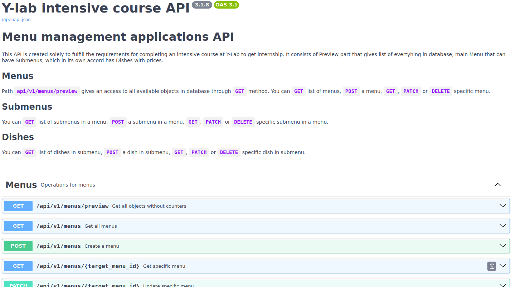

# Домашнее задание 3

Этот git-репозиторий создан исключительно для выполнения требований для прохождения стажировки в компании Y-Lab. Более подробная информация предназначена для модераторов, которые собираются ее протестировать.

# Установка и настройка проекта в docker
## 1. Клонировать репозиторий git

1. Откройте терминал.
2. Измените текущую папку либо путь на тот, где вы хотите клонировать проект с ДЗ.
3. Скопируйте эту строку кода.

```
git clone https://github.com/eddy-di/learning_fastapi.git
```

4. Вставьте приведенную выше команду в терминал и нажмите Enter.

## 2. Запуск WEB сервера в docker

1. предполагается что у вас уже установлен Docker.

> Данный образ и контейнеры в нем предназначены для прогона тестов через Postman. Прежде чем начать тестирование прошу убедитесь в том что в докере не остались включенными или занимают порты/хосты другие образы или контейнеры, в случае если есть таковые просьба очистить или удалить все связанные с этим заданием по меню контейнеры, образы, волюмы (volumes) и билды (builds) через CLI или Docker Desktop.

2. Перейдите в корневую директорию проекта и введите в командную:

```
docker compose -f docker-compose.yaml up -d --build
```

3. Это позволит в виртуальной среде установить все пакеты и запустить проект в docker'e.
4. Проект доступен через браузер по адресу:

```
http://localhost:8000/docs
```

Вы должны будете увидеть такую страницу с реализованными эндпоинтами: 

5. Для правильной реализации проверки тестов через Postman убедитесь что порт `localhost` переменной в postman environment равна 8000. Если там стоит другое значение то надо будет изменить порт на 8000.
6. Можно приступать для запуска тестов папки `Тестовый сценарий` в Postman. 161 тест должны успешно пройти.
7. Для того чтобы отключить поднятый сервер в docker'e находясь в корневой директории проекта введите:

```
docker compose -f docker-compose.yaml down -v
```

## 3. Запуск Pytest тестов в docker

> Данный образ и контейнеры предназначены для прогона тестов через pytest. Нижеуказанная команда в подпункте 1 реализует сценарий поднятия проекта, запроса команды `pytest -v` и удаления контейнеров проекта. Для корректной работы убедитесь что все другие контейнеры или образы docker не запущены. В случае если порты будут заняты другими проектами то необходимо остановить их.

1. Перейдите в корневую директорию проекта и введите в терминале данную команду:

```
docker-compose -f docker-compose-tests.yaml up -d && docker logs --follow test_web && docker compose -f docker-compose-tests.yaml down -v
```

Если вы тестируете через Windows PowerShell введите данную команду:

```
docker-compose -f docker-compose-tests.yaml up -d; docker logs --follow test_web; docker compose -f docker-compose-tests.yaml down -v
```

2. Это позволит вам увидеть в терминале результат успешно выполненных 32 тестов.
3. По тестовому сценарию проверки кол-ва блюд и подменю в меню из Postman с помощью pytest можете ознакомиться по [этой ссылке](https://github.com/eddy-di/learning_fastapi/blob/main/tests/test_case4_counters.py).
4. Юнит тесты проверяющие CRUD эндпоинтов по меню доступны [тут](https://github.com/eddy-di/learning_fastapi/blob/main/tests/test_menu_crud.py).
5. Юнит тесты проверяющие CRUD эндпоинтов по подменю доступны [тут](https://github.com/eddy-di/learning_fastapi/blob/main/tests/test_submenu_crud.py).
6. Юнит тесты проверяющие CRUD эндпоинтов по блюдам доступны [тут](https://github.com/eddy-di/learning_fastapi/blob/main/tests/test_dish_crud.py).


## 4. Путь к сложному ORM запросу

1. Можете увидеть выполнение SQLAlchemy ORM запроса по [этой ссылке](https://github.com/eddy-di/learning_fastapi/blob/469fca66b163d470eb87ff92a5537a41f532781f/app/services/database/menu.py#L24).
2. В переменной `menus` хранится ORM запрос к базе данных. Начало 25 линия, конец 33.

## 5. Пункты 3 Домашнего задания

1. Вынести бизнес логику и запросы в отдельные слои приложения:
    - бизнес логика доступна по пути [`.app/services/api`](https://github.com/eddy-di/learning_fastapi/tree/main/app/services/api),
    - запросы в redis кэш доступны по пути [`.app/services/cache`](https://github.com/eddy-di/learning_fastapi/tree/main/app/services/cache),
    - запросы в базу данных доступны по пути [`.app/services/database`](https://github.com/eddy-di/learning_fastapi/tree/main/app/services/database).

2. Кеширование запросов API происходит по пути `.app/services/cache` с разделением на файлы для каждой модели отдельно. Инвалидация кэша происходит в методах с названием `invalidate_<model_name>s`, например [тут](https://github.com/eddy-di/learning_fastapi/blob/469fca66b163d470eb87ff92a5537a41f532781f/app/services/cache/dish.py#L27), расположенных в классах `<ModelName>CacheCRUD`, например [тут](https://github.com/eddy-di/learning_fastapi/blob/469fca66b163d470eb87ff92a5537a41f532781f/app/services/cache/dish.py#L8).

3. pre-commit хуки в проект добавлены, изменения были в двух местах:
    - [строка 8](https://github.com/eddy-di/learning_fastapi/blob/895b422e3cf234199f8bfd745feceaba9bd34eeb/.pre-commit-config.yaml#L8): `id: check-toml` так как используется poetry,
    - [строка 52](https://github.com/eddy-di/learning_fastapi/blob/895b422e3cf234199f8bfd745feceaba9bd34eeb/.pre-commit-config.yaml#L52): `additional_dependencies: [types-redis, types-requests]` ругался в работе с редис

4. Везде добавлены typehints кроме функции [`create_redis`](https://github.com/eddy-di/learning_fastapi/blob/895b422e3cf234199f8bfd745feceaba9bd34eeb/app/config/cache.py#L6) отвечающей за подключение к базе Redis из `.app/config/cache.py`, не получается даже с предыдущим 2 подпунктом pre-commit хука.

5. В роутерах присутствуют `response_model=`, [пример](https://github.com/eddy-di/learning_fastapi/blob/469fca66b163d470eb87ff92a5537a41f532781f/app/routers/dish.py#L20), у всех API эндпоинтов. А также добавлены метаданные для более точного описания эндпоинтов и за что они ответственны. Добавлены теги для каждой модели в роутерах, а также метаданные (имя и описание) в [`main.py`](https://github.com/eddy-di/learning_fastapi/blob/main/app/main.py) в [`openapi_tags=`](https://github.com/eddy-di/learning_fastapi/blob/895b422e3cf234199f8bfd745feceaba9bd34eeb/app/main.py#L30) части.

6. Добавлена функция [`reverse()`](https://github.com/eddy-di/learning_fastapi/blob/895b422e3cf234199f8bfd745feceaba9bd34eeb/app/utils/pathfinder.py#L15), используется в тестах pytest, [пример](https://github.com/eddy-di/learning_fastapi/blob/5794d5241c145fe9e5a3152010c3814227e9a37a/tests/test_case4_counters.py#L26).

## 6 Пункты ДЗ 4

1. Переход от синхронного к асинхронному при соединении к базе данных и кэшу, а также слой бизнес логики асинхронен.
2. Добавление фоновых задач с проверками и перепроверками доступны [тут](app/celery/).
3. Добавлено новый эндпоинт с выводом всех имеющихся объектов в базе данных.
---
